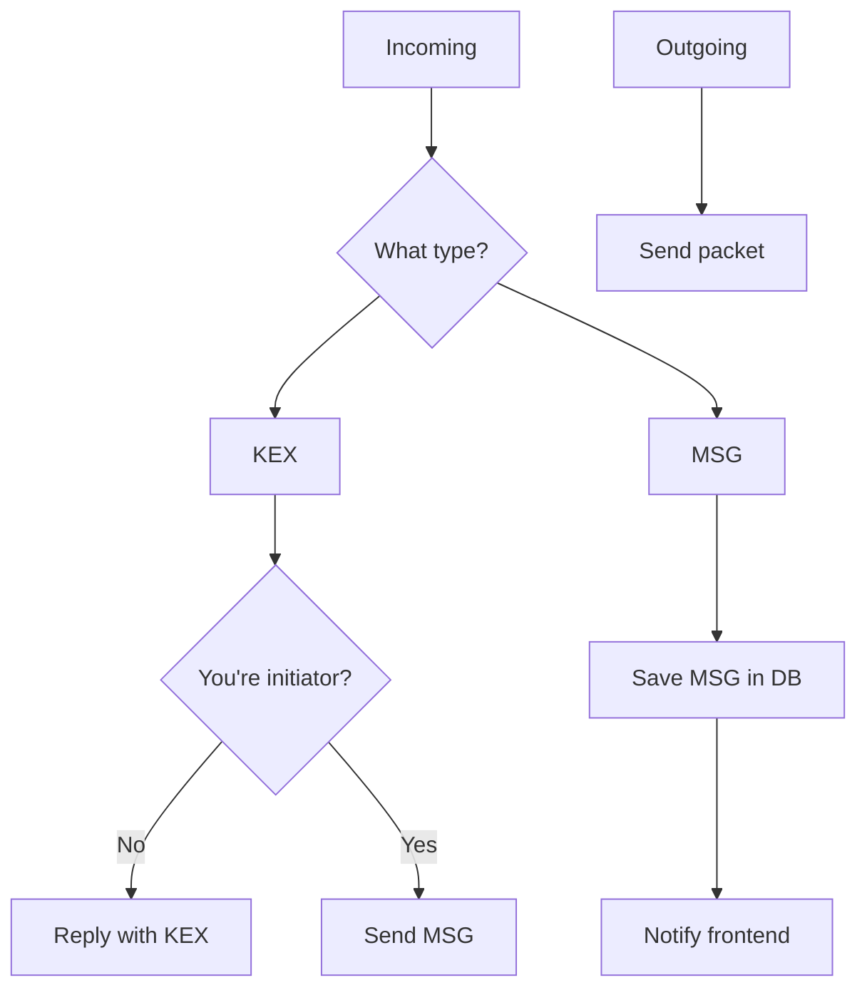

# The Nsc Protocol
This document contains all the required information you need to know to implement
a basic Nsc-compatible server and client. If you want to implement a server and/or
client that is compatible with *instant messaging* you should have a look at the 
[protocol extensions](protocol-extensions.md).

## Basic structure
The protocol is built to be easily understandable by a human (before serialization that is).
It's in the json format, which was chosen because of availablity across different systems and
programming languages.

It's built up in a way that only requires 3 different packets for communication between
client and server. A packet is a dictionary with at least one key-value pair, with the key
being TYPE and the value being one of the supported packet names. Example: `{TYPE: USR}`

All keys (and values for TYPE) in a packet are integers. To make sense of them 
the following enum layout is used:

```
TYPE USR KEX MSG PK PEK FROM TO CONTS
1    2   3   4   5  6   7    8  9
```

The type of values will depend on the specific packet or protocol extension.

Both client and server need to implement at least these following packets with the 
associated procedures:

### USR packet
Signature: `{TYPE: USR, PK: <PUB_KEY>}`

This packet is used standalone but also within all other base packets
(KEX and MSG).

It is the first packet that must be sent by the client after connecting 
to an Nsc server. It starts the initialization sequence.

#### Initialization sequence
This sequence is used to verify that the client is the one it claims to
be with their `PUB_KEY`. This is important because else a bad client using
a `PUB_KEY` that they don't own (don't have the secret key to) could connect
and spy on other clients.

Esentially this sequence is just a key exchange:

```
#1: Client A sends their USR packet to the Server S
A -(USR)> S

#2: S creates own secret key, and sends back the corresponding public key
    in a USR packet.
S -(USR)> A

#3: A uses the shared secret of A(sk), S(pk) to encrypt the CONTENT of a
    MSG packet. CONTENT is A's PUB_KEY.
A -(MSG)> S

#4: S decrypts the message with the shared secret of S(sk), A(pk)
    Sucess: S checks if the CONTENTS are A's PUB_KEY
            Sucess: S puts A's PUB_KEY (and other data) into memory
            Failure: S closes connection.
    Failure: S closes connection.
```

### KEX packet
Signature: `{TYPE: KEX, PEK: <Public exchange key>, FROM: <F_PUB_KEY>, TO: <TO_PUB_KEY>}`

This packet is used for starting a key exchange between 2 connected and verified clients.
The PEK must be unique for each sent KEX packet.

### MSG packet
Signature: `{TYPE: MSG, CONTS: <CONTENTS>, FROM: <F_PUB_KEY>, TO: <TO_PUB_KEY>}`

CONTENTS: Encoding specified by a protocol extension.

This packet is used to carry the actual (encrypted) message data, after a finished 
key exchange.

## Serialization
Before transmission the packets get encoded into BSON (Binary JSON). This was
done as with normal json you can't have binary data, which Nsc mostly uses.

## More information
- Whenever you saw `*_KEY` in one of the packet signatures above, the key
used was always the binary representation of a libsodium public key. 
- All servers and clients are expected to use libsodium for cryptography, or settings that
are compatible with libsodium.

If you need more information on the internal structure/control flow, have a 
peek at the reference implementations. Here a are also some flowcharts that may help you:

### Flowcharts
#### Client
